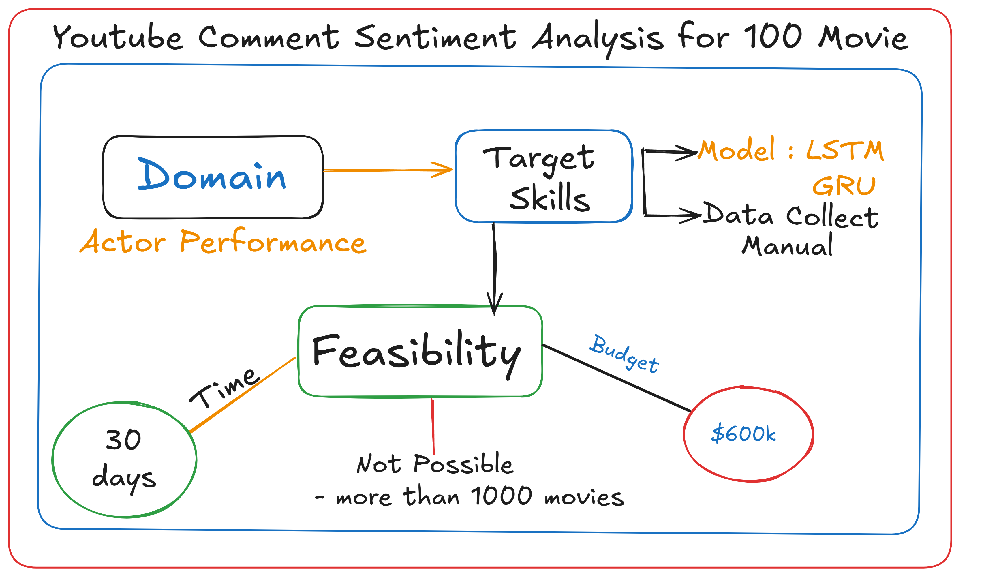
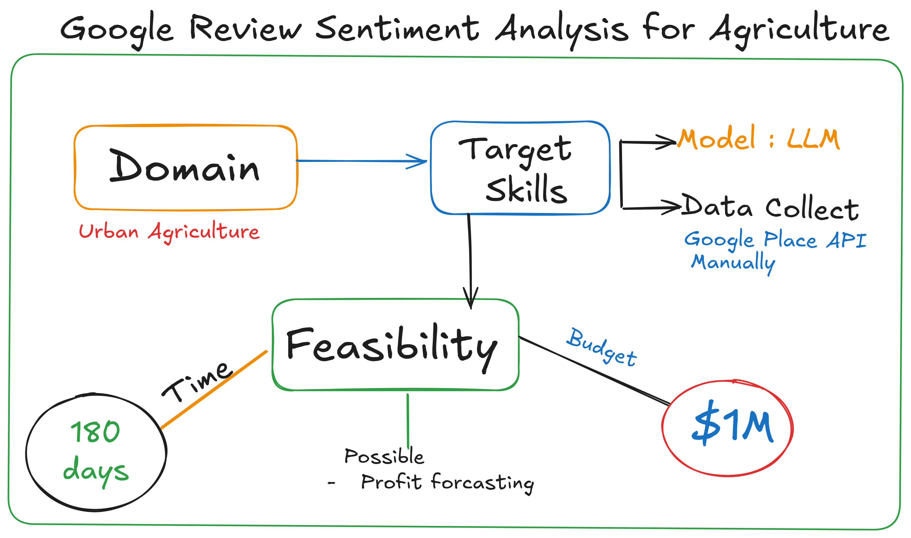
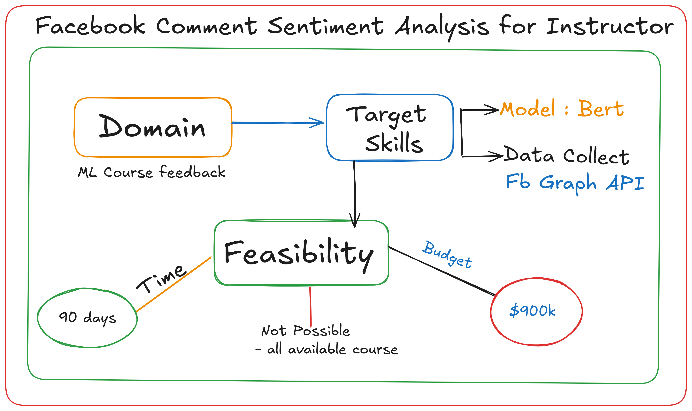

# Basic of Pipeline 

A machine learning pipeline is a series of interconnected data processing and modelling steps designed to automate, standardize and streamline the process of building, training, evaluating and deploying machine learning models. For more check out [IBM - Machine Learning Pipeline](https://www.ibm.com/think/topics/machine-learning-pipeline)

Traditionally, We(some learners) assume pipeline means starting from direct data collection to deployment. That is not wrong, but before collecting data we have to spend a good amount of time on `Requirement analysis` and `Feasibility Check`.


## Requirement analysis and Feasibility Check

  - Step-01: Domain Select ( Specific problem solution eg : health care )
  - Step -02 : Target Skills ( Pre model select , Data source and format )
  - Step-03: Time and Budget, also what is possible or not

```Some Examples of NLP pipeline```
### Case - 01 

<h4>Actor Performance Prediction with the Help of YouTube Comment Sentiment Analysis</h4>




### Case - 02

<h4>Recommand Urban Agriculture based on Google Review sentiment analysis</h4>



### Case - 03

<h4>ML Course Feedback analysis based on Facebook Comment</h4>



Here we planing to use Bert model and Data collection by help of `FB Graph API` . Estimate time 90 days and the amount of budget $900k